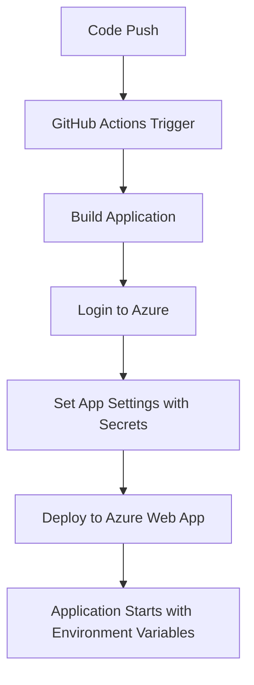

# 🔧 GitHub Workflow Fixes for Environment Variables

## 🚨 Issue Fixed

**Problem**: Azure Web App deployment was not receiving the `COSMOS_DB_ENDPOINT` and `COSMOS_DB_PRIMARY_KEY` environment variables, causing the application to fail at startup.

**Root Cause**: The GitHub Actions workflow was missing:
1. Environment configuration for the deployment job
2. Step to set application settings in Azure Web App before deployment

## ✅ Changes Made

### 1. Added Environment Configuration
```yaml
deploy:
  environment: 
    name: 'Production'
    url: ${{ steps.deploy-to-webapp.outputs.webapp-url }}
```
- ✅ Enables proper environment tracking in GitHub
- ✅ Provides deployment URL for easy access
- ✅ Allows environment-specific secret management

### 2. Added App Settings Configuration Step
```yaml
- name: Set App Settings
  run: |
    # Set the resource group name (use secret if provided, otherwise default)
    RESOURCE_GROUP="${{ secrets.AZURE_RESOURCE_GROUP }}"
    if [ -z "$RESOURCE_GROUP" ]; then
      RESOURCE_GROUP="slash-alert-api_group"
    fi
    
    # Set application settings for Cosmos DB
    az webapp config appsettings set \
      --name slash-alert-api \
      --resource-group $RESOURCE_GROUP \
      --settings \
        COSMOS_DB_ENDPOINT="${{ secrets.COSMOS_DB_ENDPOINT }}" \
        COSMOS_DB_PRIMARY_KEY="${{ secrets.COSMOS_DB_PRIMARY_KEY }}"
  shell: bash
```

### Key Benefits:
- ✅ **Secure**: Uses GitHub Secrets to inject environment variables
- ✅ **Flexible**: Falls back to default resource group if not specified
- ✅ **Reliable**: Sets app settings before deployment
- ✅ **Explicit**: Clear error handling and shell specification

## 🔄 How It Works Now

1. **Build Stage**: Compiles and packages the application
2. **Deploy Stage**: 
   - Downloads build artifacts
   - Authenticates with Azure
   - **NEW**: Sets Azure Web App application settings from GitHub Secrets
   - Deploys the application package
   - Application starts with proper environment variables

## 🔐 Required GitHub Secrets

Make sure these secrets are configured in your GitHub repository:

| Secret Name | Required | Description |
|-------------|----------|-------------|
| `COSMOS_DB_ENDPOINT` | ✅ Yes | Azure Cosmos DB endpoint URL |
| `COSMOS_DB_PRIMARY_KEY` | ✅ Yes | Azure Cosmos DB primary access key |
| `AZURE_RESOURCE_GROUP` | ❌ Optional | Resource group name (defaults to "slash-alert-api_group") |

## 🧪 Testing the Fix

### Before Deployment
1. Ensure all required GitHub Secrets are configured
2. Verify the Azure resource group name matches your setup

### After Deployment
1. Check Azure Web App → Configuration → Application Settings
2. Verify `COSMOS_DB_ENDPOINT` and `COSMOS_DB_PRIMARY_KEY` are set
3. Monitor application startup logs for successful Cosmos DB connection

## 📊 Deployment Flow



## 🚨 Important Notes

- The application will fail to start if `COSMOS_DB_ENDPOINT` or `COSMOS_DB_PRIMARY_KEY` are not set
- Azure CLI step runs before deployment to ensure environment variables are available immediately
- Default resource group name can be overridden by setting the `AZURE_RESOURCE_GROUP` secret

This fix ensures your Azure Web App receives the necessary environment variables for Cosmos DB connectivity! 🚀